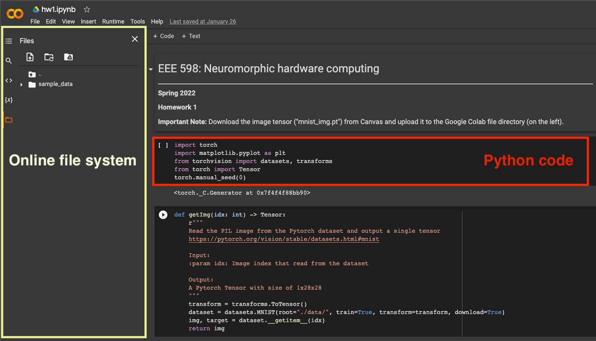

# Pytorch & Google Colab: Toolbox for EEE 598

**EEE 598: Neuromorphic Hardware Computing Design**

**Instructor: Jae-sun Seo**

**Spring 2022**

**Arizona State University**

------

This tutorial presents the basic instructions for setting up Pytorch and Google Colab.

Briefly speaking, [Pytorch](https://pytorch.org/docs/master/index.html) is a system-level library for artificial intelligence development, including deep neural network (DNN) construction with various model architectures. The massive amount of computation of the DNN can be alleviated by GPU-based acceleration. With the advantage of simplicity and high customization, Pytorch has been widely employed in both academia and industry. 

Apart from the homework assignments published on Canvas, this document will keep updating throughout the entire semester and guide you through the Pytorch related implementations. 

## News

**[Jan 27]: Pytorch installation and Google Colab tutorial are created.**

## Table of Content:

- [Pytorch installation](https://github.com/mengjian0502/NCHW-Tutorial#pytorch-installation)
  - Python environment setup

- [Access Google Colab](https://github.com/mengjian0502/NCHW-Tutorial#access-google-colab)
  - Import Python dependencies 
  - Execute `.ipynb` file
- [Useful functions for homework assignments](https://github.com/mengjian0502/NCHW-Tutorial#useful-functions-for-homework-assignments)


## Pytorch Installation

### Python environment setup

The Python environment of this course is built based on [Anaconda3](https://docs.anaconda.com/anaconda/install/), with Python 3.8.  The major libraries that will be used in this course are:

```python
pytorch=1.9.0
torchvision=0.10.0
numpy=1.21.2
matplotlib=3.5.0
```

Along with other related dependencies, the packed Python environment file `nchw_py38.yml` is available on Canvas, **<u>download it before proceeding to the next step</u>.**

#### Install Python environment with Anaconda 

Login to the `eecad` server with your ASURITE account (via SSH), you should be able to see the `(base)` sign at the very  begining of your command interface:

```bash
(base) ASURITE@eecad12:~$
```

`(base)` means you are currently under the <u>base environment</u> that created by Anaconda3, with Python3 installed. To create a new environment and install all the required libraries, upload the downloaded environment file to the eecad server and execute the following line: 

```python
conda env create -f ./nchw_py38.yml
```

**Make sure the environment file is in the same directory as you executing the above command!** 

After the installation is successfully completed, activating the installed environment with the following commaned:

```bash
conda activate nchw_py38
```

Subsequently, your command interface becomes:

```bash
(nchw_py38) ASURITE@eecad12:~$
```

Now your are under a new Python environment where the Pytorch is successfully installed. To check the installed environment, execute `conda list `  in your command line. The Pytorch that installed on the `eecad` server is for CPU-only usage, this document will be updated when the GPU-based neural network training is asigned. 

At this point, you should be able to execute the Python files (`.py`). 

#### Useful links

- Managing your Anaconda environment: ([link](https://conda.io/projects/conda/en/latest/user-guide/tasks/manage-environments.html#))

- Pytorch document & tutorials: ([link](https://pytorch.org/docs/stable/index.html))


## Access Google Colab

In addition to the local Python environment that installed on the `eecad` server, using the web-based online Python platform is also a feasible solution. Different from the `base` environment of the Anaconda, Google Colab provides the up-to-date libraries that already installed in their online Python environment. 

#### Step 1

To start, go to https://colab.research.google.com/ and login with your ASURITE account. 

If you are new Google Colab, you should be able to see a welcoming page and a pop-up window with all the potential file locations: 


#### Step 2

For each homework, we provide the code template in both `.py` Python files and `.ipynb` files. Upload your `.ipynb ` file to your <u>Google Drive</u> and open it:



- The **online file system** (left) temporarily saves all the input and output files. **In homework 1, the image file `mnist_img.pt` should be uploaded to the left for for data loading. ** The generated plot will be saved inside the same location, **<u>make sure you download all the necessary files before closing the webpage.</u>** 
- In Google Colab, the code is executed cell by cell, as shown in the red ractangle in the figure. Press `Shift + Enter` to execute each individual cell. To execute all the cells, go to `Runtime`  and select `Run all` . You can also use `Restart and run all` to flush all the intermediate results then running all the cells again. 

- All the uploaded files can be found in your `Colab Notebooks` inside your Google Drive.


## Useful functions for homework assignments 

### Homwork 1

(Coming soon)
